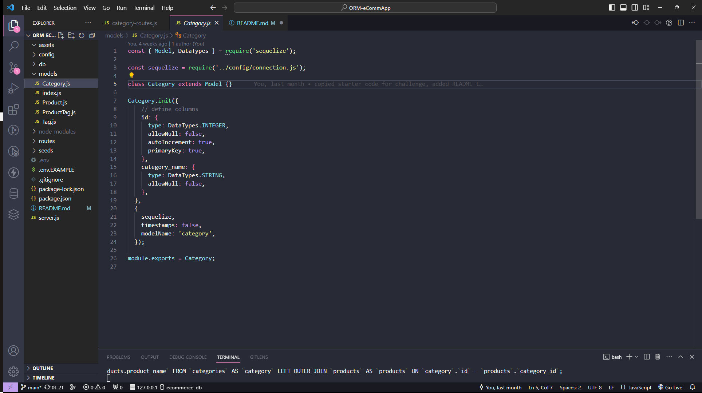

# ORM-eCommApp

## Description
This assignment was to modify starter code to create the back-end functionality for an e-commerce website. This application employs the use of Sequelize via various Express.js API routes to interact with a MySQL database. For this challenge, I was required to demonstrate my ability to create connections between multiple MySQL tables, and understand their relationships to one-another in order to retrieve the correct data response using API routing. It was required that I create each model for Category, Product, Tag and ProductTag as well. This application uses RESTful CRUD Operations to interact with, and change the data within the corresponding tables.

## Screenshot
  
  
   

## Links
[GitHub Repo](https://github.com/sailorshy94/ORM-eCommApp)  
[Walkthrough Video](https://drive.google.com/file/d/1_qJnBD1A2ZszW9oZJhq3sMywR12Gds6A/view)